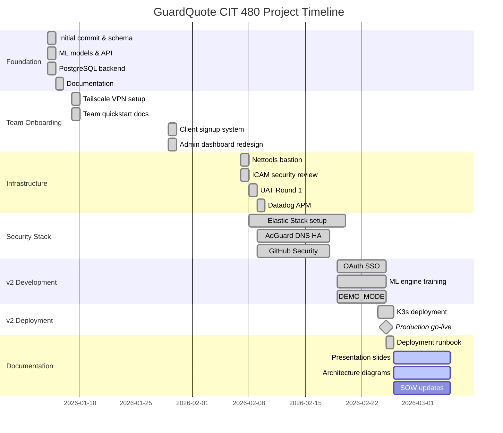

# GuardQuote

**ML-powered security service pricing platform**

Get instant, accurate quotes for security services — from event security to executive protection.

🌐 **Live Site:** https://guardquote.vandine.us  
📊 **Admin Dashboard:** https://guardquote.vandine.us/admin  
📋 **Project Board:** [GitHub Projects](https://github.com/users/jag18729/projects/1)  
📐 **Deployment Runbook:** [docs/GUARDQUOTE-V2-DEPLOYMENT.md](./docs/GUARDQUOTE-V2-DEPLOYMENT.md)

---

## ✅ v2.0 — DEPLOYED

**Production URL:** https://guardquote.vandine.us  
**Deployed:** February 25, 2026

### What's Live
- ✅ **OAuth SSO** — GitHub, Google, Microsoft login
- ✅ **ML Engine** — GradientBoost (R²=0.93), RandomForest (81%)
- ✅ **Bun Backend** — Hono API with JWT auth
- ✅ **K3s Deployment** — Pi cluster infrastructure
- ✅ **DEMO_MODE** — Showcase mode for presentations

---

## 👥 Team

| Name | GitHub | Role | Responsibilities |
|------|--------|------|------------------|
| **Rafael Garcia** | [@jag18729](https://github.com/jag18729) | Lead Developer | App dev, CI/CD, ML, SSO/OAuth, networking & infrastructure |
| **Milkias Kassa** | [@Malachizirgod](https://github.com/Malachizirgod) | ICAM Lead + PM | Security review (OWASP), GitHub Projects, documentation |
| **Isaiah Bernal** | [@ibernal1815](https://github.com/ibernal1815) | Security Ops | SIEM, IDS/IPS, detection rules, Elastic Stack |
| **Xavier Nguyen** | [@xan942](https://github.com/xan942) | UX Lead + UAT | User experience, UAT driver, presentations, slides |

---

## 📅 Project Timeline



---

## 🏗️ Architecture

**Zero AWS. Zero monthly cost. Full ownership.**

### Production Architecture (v2)
```
Internet
    │
    ▼
Cloudflare Tunnel (vandine-tunnel)
    │
    ▼
┌─────────────────────────────────────────────────────────────────┐
│ pi1 (192.168.20.10) — Tunnel Ingress                           │
│  cloudflared → Tailscale mesh                                   │
└─────────────────────────────────────────────────────────────────┘
    │
    ▼ Tailscale
┌─────────────────────────────────────────────────────────────────┐
│ pi2 (192.168.22.10) — K3s Cluster                              │
│                                                                 │
│  ┌─────────────────────┐   ┌─────────────────────┐             │
│  │ guardquote-frontend │   │ guardquote-backend  │             │
│  │ nginx + React SPA   │──►│ Bun + Hono API      │             │
│  │ :30522              │   │ :30520              │             │
│  └─────────────────────┘   └──────────┬──────────┘             │
│                                       │ gRPC                    │
│                            ┌──────────▼──────────┐             │
│                            │ guardquote-ml       │             │
│                            │ FastAPI + sklearn   │             │
│                            │ :30521              │             │
│                            └─────────────────────┘             │
└─────────────────────────────────────────────────────────────────┘
    │
    ▼
PostgreSQL (192.168.2.70:5432)
```

### Network Topology
```
Studio (Reveal SOHO):
├── ThinkStation           — Dev workstation, OpenClaw gateway
├── PA-220 reveal-fw       — Palo Alto firewall, 4 security zones
├── UDM                    — UniFi gateway/router
├── pi0                    — DNS, SNMP, log shipping (dmz-mgmt)
├── pi1                    — Monitoring: Grafana/Prometheus/Loki (dmz-services)
├── pi2                    — K3s workloads: GuardQuote, MarketPulse (dmz-security)
└── Orange Pi RV2          — Suricata IDS, LLM alert triage (dmz-security)

Remote:
└── pi3                    — Off-site monitoring, Tailscale mesh
```

---

## 💻 Tech Stack

| Layer | Technology |
|-------|------------|
| **Frontend** | React 18, TypeScript, Vite, Tailwind, React Router 7 |
| **Backend** | Bun 1.3 + Hono, JWT auth |
| **Auth** | OAuth 2.0 (GitHub, Google, Microsoft) + PKCE |
| **ML Engine** | Python FastAPI, GradientBoost, RandomForest |
| **Database** | PostgreSQL 16 |
| **Orchestration** | K3s (ARM64) |
| **Edge** | Cloudflare Tunnel + Tailscale mesh |
| **Monitoring** | Grafana, Prometheus, Loki, Vector |
| **Security** | PA-220 firewall, Suricata IDS, Wazuh SIEM |

**Operational Cost: $0/month** ✨

---

## 🧠 ML Engine

### Model Performance

| Model | Metric | Score |
|-------|--------|-------|
| **GradientBoost** | Price R² | 0.93 |
| **RandomForest** | Risk Accuracy | 81% |

### Training Data
- 500+ historical quotes
- 15 event types
- 28 locations across US

---

## 🔐 Authentication

### OAuth SSO Providers

| Provider | Status | Scopes |
|----------|--------|--------|
| **GitHub** | ✅ Live | `read:user`, `user:email` |
| **Google** | ✅ Live | `openid`, `email`, `profile` |
| **Microsoft** | ✅ Live | `openid`, `email`, `profile` |

- PKCE flow for security
- JWT session tokens
- Account linking by verified email

---

## 🚀 Quick Start

### Development

```bash
git clone https://github.com/jag18729/guard-quote.git
cd guard-quote

# Frontend
cd frontend && npm install && npm run dev
# → http://localhost:5173

# Backend
cd backend && bun install && bun run dev
# → http://localhost:3000

# ML Engine
cd ml-engine && pip install -e . && uvicorn src.server:app
# → http://localhost:8000
```

### Demo Mode
```bash
DEMO_MODE=true bun run src/index.ts
# Mock data, no external dependencies
```

---

## 📁 Project Structure

```
guard-quote/
├── frontend/           # React 18 + Vite + Tailwind
│   ├── src/
│   │   ├── pages/      # Landing, QuoteForm, Login, admin/
│   │   └── components/
│   └── nginx.conf      # Production reverse proxy
├── backend/            # Bun + Hono API
│   ├── src/
│   │   ├── index.ts    # Main entry
│   │   └── services/   # auth, oauth, quote-calculator
│   └── Dockerfile
├── ml-engine/          # Python FastAPI + sklearn
│   ├── src/
│   │   ├── server.py   # REST + gRPC server
│   │   └── models/     # Trained models
│   └── Dockerfile
├── docs/
│   ├── GUARDQUOTE-V2-DEPLOYMENT.md  # Production runbook
│   └── plans/
└── README.md
```

---

## 🔗 Links

| Resource | URL |
|----------|-----|
| **Live Site** | https://guardquote.vandine.us |
| **Project Board** | https://github.com/users/jag18729/projects/1 |
| **Deployment Runbook** | [docs/GUARDQUOTE-V2-DEPLOYMENT.md](./docs/GUARDQUOTE-V2-DEPLOYMENT.md) |
| **Grafana** | https://grafana.vandine.us |

---

## 📄 License

Private — California State University, Northridge — CIT 480 Senior Design Project

---

*Last updated: 2026-02-25*
