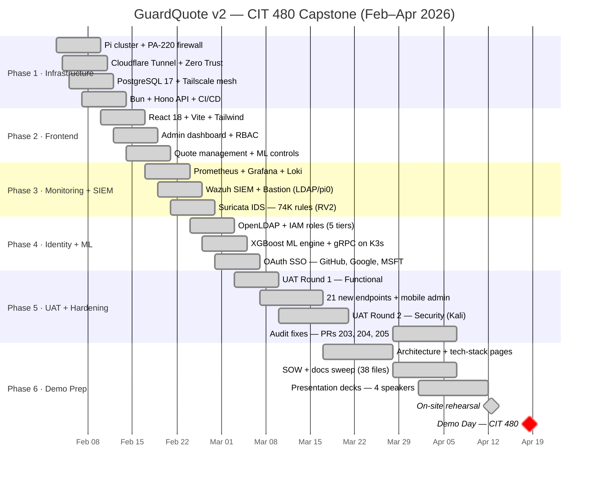

# GuardQuote Sprint Schedule

**Project Duration:** Feb 6 - April 27, 2026
**Spring Break:** March 16-22, 2026
**Final Presentation:** Last weekend of April (April 25-26)

---

## Bi-Weekly Sprint Overview

| Sprint | Dates | Focus | Deliverables |
|--------|-------|-------|--------------|
| Sprint 1 | Feb 6-14 | SIEM Integration | Wazuh operational, UAT Round 1 |
| Sprint 2 | Feb 17-28 | Security & Testing | UAT Round 2, Peer Review |
| Sprint 3 | Mar 3-14 | Documentation | Full docs, presentation v1 |
| **Break** | Mar 16-22 | Spring Break | - |
| Sprint 4 | Mar 24 - Apr 4 | Polish & ML | ML improvements, bug fixes |
| Sprint 5 | Apr 7-18 | Final Testing | Regression testing, demo prep |
| Sprint 6 | Apr 21-27 | Presentation | Dry runs, final presentation |

---

## Sprint 1: SIEM Integration
**Feb 6-14 (Current)**

### Standup: Friday Feb 7 @ 3 PM
- Review completed infrastructure
- Isaiah: Wazuh manager status
- Milkias/Xavier: Site review feedback

### Deliverables by Feb 14
| Owner | Deliverable | Status |
|-------|-------------|--------|
| Rafa | Infrastructure complete | Done |
| Rafa | Monitoring stack live | Done |
| Rafa | Data flow diagram | Done |
| Isaiah | Wazuh manager deployed | ⏳ |
| Isaiah | Agent keys generated | ⏳ |
| Milkias | Site review feedback | ⏳ |
| Xavier | Site review feedback | ⏳ |

### UAT Round 1: Feb 14
- Functional testing all features
- Mobile responsiveness check
- API endpoint validation

---

## Sprint 2: Security & Testing
**Feb 17-28**

### Standup: Friday Feb 21
- UAT Round 1 results
- Security testing status
- Documentation progress

### Deliverables by Feb 28
| Owner | Deliverable | Status |
|-------|-------------|--------|
| Isaiah | Wazuh agents on pi0/pi1 | ⏳ |
| Isaiah | Bastion host operational | ⏳ |
| Isaiah | Detection rules configured | ⏳ |
| Isaiah | Security dashboards | ⏳ |
| Milkias | IAM documentation | ⏳ |
| Milkias | Presentation slides v1 | ⏳ |
| Xavier | Cost analysis doc | ⏳ |
| Xavier | Timeline updated | ⏳ |
| Rafa | Bug fixes from UAT1 | ⏳ |

### UAT Round 2: Feb 19
- Security testing
- Edge case testing
- SIEM validation

### Peer Review: Feb 21
- Cross-team code review
- Documentation review
- Presentation feedback

---

## Sprint 3: Documentation
**Mar 3-14**

### Standup: Friday Mar 7
- Documentation status
- Presentation review
- Pre-break checklist

### Deliverables by Mar 14 (Before Spring Break)
| Owner | Deliverable | Status |
|-------|-------------|--------|
| Rafa | API documentation complete | ⏳ |
| Rafa | Deployment guide | ⏳ |
| Rafa | Architecture diagrams final | ⏳ |
| Isaiah | SIEM runbook | ⏳ |
| Isaiah | Security procedures doc | ⏳ |
| Milkias | Full presentation draft | ⏳ |
| Milkias | User guide | ⏳ |
| Xavier | Final cost analysis | ⏳ |
| Xavier | References complete | ⏳ |
| All | UAT sign-off documented | ⏳ |

### Pre-Break Checkpoint
- All core features working
- All security components operational
- Documentation 80% complete
- Presentation v1 ready for review

---

## Spring Break
**Mar 16-22**

No meetings. Optional async work if desired.

---

## Sprint 4: Polish & ML
**Mar 24 - Apr 4**

### Standup: Friday Mar 28
- Post-break sync
- ML model status
- Bug backlog review

### Deliverables by Apr 4
| Owner | Deliverable | Status |
|-------|-------------|--------|
| Rafa | ML model improvements | ⏳ |
| Rafa | SSO/OAuth (if time) | ⏳ |
| Rafa | Performance optimization | ⏳ |
| Isaiah | SIEM refinements | ⏳ |
| Milkias | Presentation v2 | ⏳ |
| Xavier | Demo script draft | ⏳ |

---

## Sprint 5: Final Testing
**Apr 7-18**

### Standup: Friday Apr 11
- Regression testing status
- Demo environment check
- Presentation review

### Deliverables by Apr 18
| Owner | Deliverable | Status |
|-------|-------------|--------|
| All | Regression testing complete | ⏳ |
| All | Bug fixes finalized | ⏳ |
| All | Demo environment verified | ⏳ |
| Milkias | Presentation final | ⏳ |
| Xavier | Demo script final | ⏳ |
| Isaiah | Security demo ready | ⏳ |

### Dry Run #1: Apr 18
- Full presentation rehearsal
- Timing check
- Feedback collection

---

## Sprint 6: Presentation
**Apr 21-27**

### Standup: Wednesday Apr 23
- Final prep check
- Role assignments
- Backup plans

### Deliverables by Apr 25
| Owner | Deliverable | Status |
|-------|-------------|--------|
| All | Presentation polished | ⏳ |
| All | Demo stable | ⏳ |
| All | Backup plan documented | ⏳ |
| All | Q&A prepared | ⏳ |

### Dry Run #2: Apr 23
- Final rehearsal
- Last-minute fixes

### Final Presentation: Apr 25-26
- Live demo
- Team presentation
- Q&A

---

## Milestone Summary

| Date | Milestone | Type |
|------|-----------|------|
| Feb 7 | Team Meeting | Standup |
| Feb 14 | UAT Round 1 | Testing |
| Feb 19 | UAT Round 2 | Testing |
| Feb 21 | Peer Review | Review |
| Feb 28 | Sprint 2 Complete | Checkpoint |
| Mar 7 | Documentation Check | Standup |
| Mar 14 | Pre-Break Complete | Checkpoint |
| Mar 16-22 | Spring Break | Break |
| Mar 28 | Post-Break Sync | Standup |
| Apr 4 | Sprint 4 Complete | Checkpoint |
| Apr 11 | Final Testing Check | Standup |
| Apr 18 | Dry Run #1 | Rehearsal |
| Apr 23 | Dry Run #2 | Rehearsal |
| **Apr 25-26** | **Final Presentation** | |

---

## Standup Format

Every Friday (except breaks):
1. **What's done** since last standup
2. **What's blocked** or needs help
3. **What's next** for upcoming week
4. **Demo** any completed features

Duration: 30-45 minutes

---

## Definition of Done

### For Code
- [ ] Code reviewed
- [ ] Tests passing
- [ ] Deployed to production
- [ ] Documentation updated

### For Documentation
- [ ] Content complete
- [ ] Reviewed by team
- [ ] Formatted consistently
- [ ] In repository

### For Presentation
- [ ] Slides complete
- [ ] Reviewed by all
- [ ] Demo tested
- [ ] Timing verified

---

*Last Updated: 2026-04-07*
